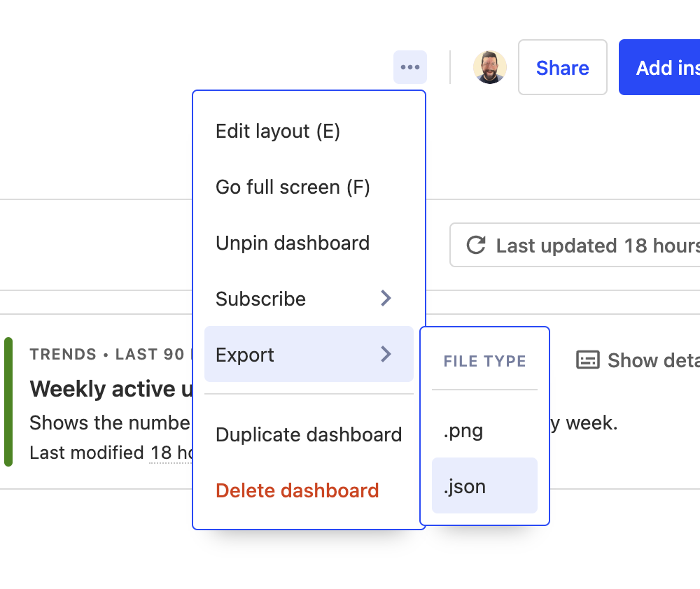

# PostHog Templates


A repository for hosting a list of PostHog Templates, both official and community ones.

## The OG template

The original PostHog template is used in several code paths that don't want to wait for a network call to GitHub - so it is not included here.

You can edit [the template in the PostHog repo](https://github.com/PostHog/posthog/blob/master/posthog/models/dashboard_templates.py#L32).

## How to add or edit a Dashboard template

There are three steps to adding or editing a template:

1. Download the template from PostHog



Any dashboard can be exported as JSON. That JSON is used as the template in this repository.

2. Add the template to this repo

Add the JSON file to the `dashboards` folder. The `template_name` in the file is used as the unique key of the template. It has to match the name in `dashboards.json` and be unique in that file.

The schema of the template is checked in CI against `dashboard-template.schema.json`

3. Add the template to the list of templates in `dashboards.json`

In a second commit get the permalink to the raw version of the template file and add it to the listing in `dashboards.json`. The permalink is used to fetch the template from the repo.

Example:

```
  {
    "name": "User research",
    "url": "https://raw.githubusercontent.com/PostHog/templates-repository/b0d0a9b4d3fdbc9c1691f03b03fa7f9fc7e8b016/dashboards/posthog-user-research.json",
    "description": "This template helps you get an idea of who your users are, how they interact with your product and what browsers or devices they use.",
    "verified": true,
    "maintainer": "official"
  }
```

4. Install or update the template in PostHog

Visit `/dashboard?tab=templates` in the PostHog instance you want to install the template in. Click the "Install" (or "Update") button next to the template you want to install.

This has to be done by a staff user and only once per instance. Templates are installed globally - i.e. for every team in the instance.
